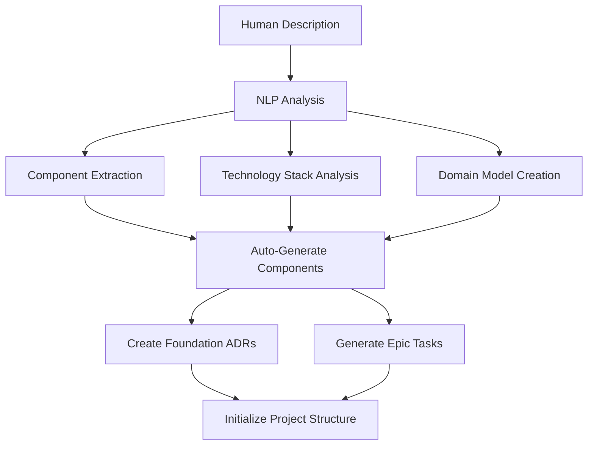
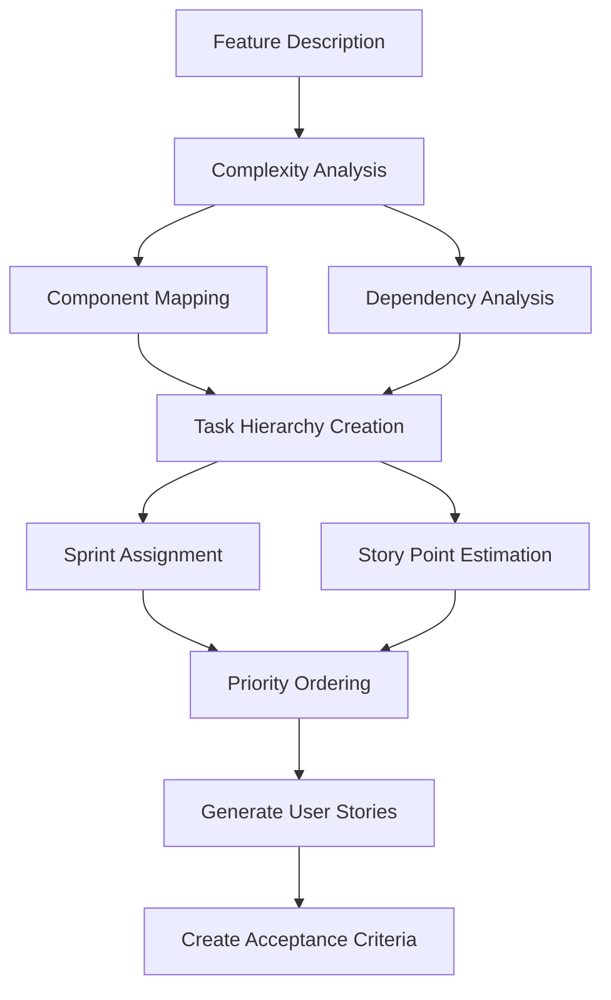
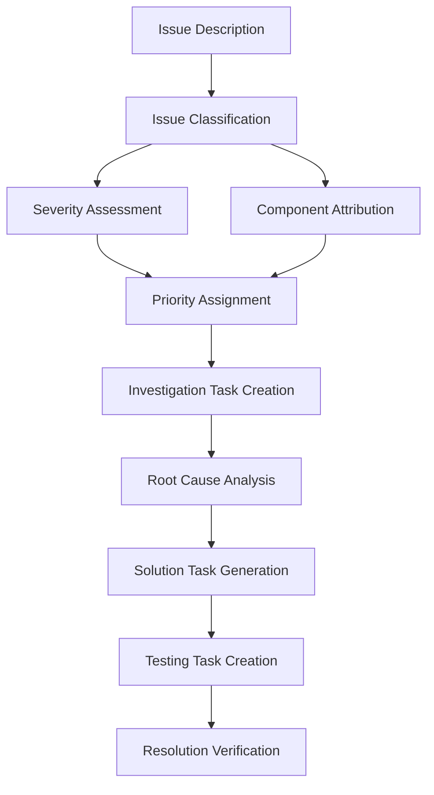
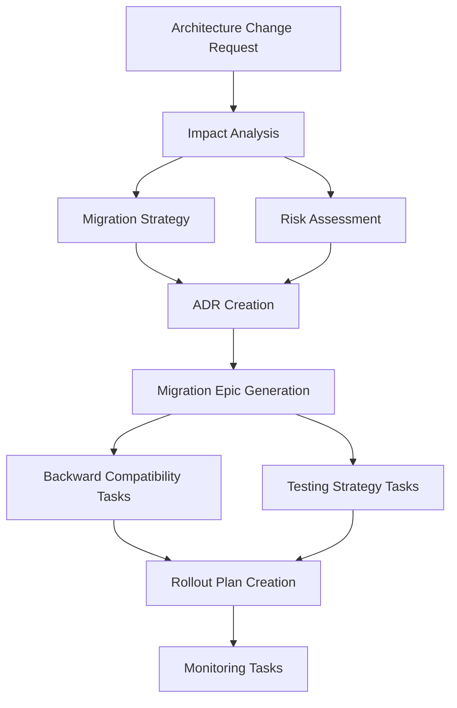

# LLMDocs - Project Evolution Pipeline

## 🌟 Overview

This document describes the automated pipeline for creating and evolving projects using LLMDocs. The system acts as an intelligent documentation orchestrator that manages the entire lifecycle of project documentation from initial concept to mature product.

---

## 🚀 Pipeline Stages

### Stage 1: Project Genesis
**Input**: High-level project description
**System Responsibility**: Extract core components and architecture



**System Actions:**
1. Parse project description using NLP
2. Identify core domains and components
3. Extract technology stack requirements
4. Generate component architecture
5. Create foundational ADRs for key decisions
6. Generate epic-level tasks for major features
7. Initialize project configuration

---

### Stage 2: Feature Decomposition
**Input**: Feature descriptions and requirements
**System Responsibility**: Break down features into implementable tasks



**System Actions:**
1. Analyze feature complexity and scope
2. Map feature to existing components
3. Identify cross-component dependencies
4. Create hierarchical task structure (Epic → Feature → Task)
5. Estimate story points based on complexity
6. Assign to appropriate sprint based on priority
7. Generate user stories with acceptance criteria

---

### Stage 3: Issue Resolution
**Input**: Bug reports, performance issues, user feedback
**System Responsibility**: Categorize and create resolution workflow



**System Actions:**
1. Classify issue type (bug, performance, usability)
2. Assess severity based on impact keywords
3. Attribute to affected components
4. Create investigation spike if needed
5. Generate resolution tasks with proper hierarchy
6. Link to existing epics or create new ones
7. Assign appropriate priority and sprint

---

### Stage 4: Architecture Evolution
**Input**: Scaling requirements, technical debt, new technologies
**System Responsibility**: Manage architectural changes and migrations



**System Actions:**
1. Analyze impact on existing components
2. Create migration strategy and phases
3. Generate comprehensive ADRs for decisions
4. Create migration epic with detailed tasks
5. Plan backward compatibility approach
6. Generate testing and validation tasks
7. Create monitoring and rollback procedures

---

## 🧠 System Intelligence Components

### Natural Language Processor
**Responsibilities:**
- Extract technical requirements from descriptions
- Identify business logic and workflows
- Recognize quality attributes (performance, security, etc.)
- Parse dependency relationships
- Assess urgency and priority indicators

**Key Algorithms:**
```python
def analyze_description(text: str) -> ProjectAnalysis:
    """
    Analyzes project description and extracts structured information
    """
    return ProjectAnalysis(
        components=extract_components(text),
        technologies=identify_tech_stack(text),
        features=parse_features(text),
        priorities=assess_priorities(text),
        dependencies=map_dependencies(text),
        quality_attributes=extract_nfrs(text)
    )
```

### Component Architect
**Responsibilities:**
- Generate component hierarchies
- Define component relationships
- Map technologies to components
- Create component ownership models
- Establish component boundaries

**Key Algorithms:**
```python
def generate_component_architecture(analysis: ProjectAnalysis) -> ComponentArchitecture:
    """
    Creates component architecture from project analysis
    """
    return ComponentArchitecture(
        services=identify_services(analysis),
        databases=identify_data_stores(analysis), 
        external_apis=identify_external_deps(analysis),
        frontend_components=identify_ui_components(analysis),
        infrastructure=identify_infrastructure(analysis)
    )
```

### Task Orchestrator
**Responsibilities:**
- Decompose features into tasks
- Create task hierarchies
- Estimate complexity and effort
- Assign to sprints and teams
- Manage dependencies

**Key Algorithms:**
```python
def decompose_feature(feature: Feature, components: List[Component]) -> TaskHierarchy:
    """
    Breaks down features into implementable tasks
    """
    epic = create_epic(feature)
    tasks = []
    
    for component in affected_components(feature, components):
        component_tasks = generate_component_tasks(feature, component)
        tasks.extend(component_tasks)
    
    return TaskHierarchy(epic=epic, tasks=tasks)
```

### Decision Engine
**Responsibilities:**
- Identify when ADRs are needed
- Generate decision context and alternatives
- Assess architectural implications
- Track decision evolution
- Link decisions to implementations

**Key Algorithms:**
```python
def identify_architectural_decisions(changes: List[Change]) -> List[ADR]:
    """
    Identifies changes that require architectural decisions
    """
    decisions = []
    
    for change in changes:
        if requires_adr(change):
            adr = generate_adr(change)
            decisions.append(adr)
    
    return decisions
```

---

## 🔄 Continuous Evolution Workflows

### Workflow 1: Feature Request Pipeline

```yaml
trigger: feature_description_received
steps:
  1. analyze_description:
      - extract_requirements
      - identify_components
      - assess_complexity
  
  2. create_structure:
      - generate_epic
      - decompose_tasks
      - create_user_stories
  
  3. plan_implementation:
      - estimate_effort
      - assign_to_sprint
      - identify_dependencies
  
  4. validate_plan:
      - check_capacity
      - validate_dependencies
      - adjust_priorities
  
  5. notify_team:
      - send_notifications
      - update_dashboards
      - trigger_planning_session
```

### Workflow 2: Bug Report Pipeline

```yaml
trigger: bug_report_received
steps:
  1. classify_issue:
      - determine_severity
      - identify_components
      - assess_impact
  
  2. create_investigation:
      - generate_spike_task
      - assign_to_expert
      - set_timeline
  
  3. plan_resolution:
      - create_fix_tasks
      - link_to_epics
      - plan_testing
  
  4. track_progress:
      - monitor_investigation
      - update_stakeholders
      - manage_escalation
```

### Workflow 3: Architecture Evolution Pipeline

```yaml
trigger: architecture_change_request
steps:
  1. impact_analysis:
      - identify_affected_components
      - assess_migration_complexity
      - evaluate_risks
  
  2. decision_documentation:
      - create_adrs
      - document_alternatives
      - capture_rationale
  
  3. migration_planning:
      - create_migration_epic
      - plan_phases
      - design_rollback_strategy
  
  4. implementation_coordination:
      - coordinate_teams
      - manage_dependencies
      - track_progress
```

---

## 🎯 Intelligent Automation Rules

### Rule Engine for Task Creation

```python
class TaskCreationRules:
    """
    Rules engine for intelligent task creation
    """
    
    def apply_rules(self, description: str) -> TaskStructure:
        rules = [
            self.epic_creation_rule,
            self.bug_classification_rule,
            self.investigation_spike_rule,
            self.dependency_linking_rule,
            self.priority_assignment_rule,
            self.sprint_assignment_rule
        ]
        
        task_structure = TaskStructure()
        
        for rule in rules:
            task_structure = rule(description, task_structure)
        
        return task_structure
    
    def epic_creation_rule(self, description: str, structure: TaskStructure) -> TaskStructure:
        """Create epic for complex features with multiple components"""
        complexity_indicators = [
            "system", "platform", "architecture", "multiple", 
            "integration", "migration", "refactor"
        ]
        
        if any(indicator in description.lower() for indicator in complexity_indicators):
            structure.needs_epic = True
            structure.epic_scope = self.extract_epic_scope(description)
        
        return structure
    
    def bug_classification_rule(self, description: str, structure: TaskStructure) -> TaskStructure:
        """Classify bugs by severity and create appropriate tasks"""
        severity_keywords = {
            "critical": ["crash", "down", "broken", "failed", "error", "cannot"],
            "high": ["slow", "performance", "timeout", "issue", "problem"], 
            "medium": ["minor", "cosmetic", "improvement", "enhancement"],
            "low": ["suggestion", "nice to have", "future", "consider"]
        }
        
        for severity, keywords in severity_keywords.items():
            if any(keyword in description.lower() for keyword in keywords):
                structure.bug_severity = severity
                structure.needs_investigation = severity in ["critical", "high"]
                break
        
        return structure
```

### Priority Assignment Logic

```python
class PriorityEngine:
    """
    Intelligent priority assignment based on multiple factors
    """
    
    def calculate_priority(self, description: str, context: ProjectContext) -> Priority:
        factors = {
            "user_impact": self.assess_user_impact(description),
            "business_value": self.assess_business_value(description),
            "technical_risk": self.assess_technical_risk(description),
            "dependencies": self.assess_dependencies(description, context),
            "urgency": self.assess_urgency(description)
        }
        
        weighted_score = sum(
            weight * score 
            for (weight, score) in zip(self.weights, factors.values())
        )
        
        return Priority.from_score(weighted_score)
    
    def assess_user_impact(self, description: str) -> float:
        """Assess impact on users (0.0 to 1.0)"""
        impact_keywords = {
            1.0: ["all users", "critical", "blocking", "cannot use"],
            0.8: ["many users", "major", "significant", "affects"],
            0.6: ["some users", "moderate", "impacts", "slows"],
            0.4: ["few users", "minor", "cosmetic", "occasional"],
            0.2: ["edge case", "rare", "unlikely", "minimal"]
        }
        
        for score, keywords in impact_keywords.items():
            if any(keyword in description.lower() for keyword in keywords):
                return score
        
        return 0.5  # Default moderate impact
```

### Sprint Assignment Intelligence

```python
class SprintAssignment:
    """
    Intelligent sprint assignment based on capacity and dependencies
    """
    
    def assign_to_sprint(self, task: Task, context: ProjectContext) -> str:
        current_sprint = context.get_current_sprint()
        
        # Check if task is urgent
        if task.priority == Priority.CRITICAL:
            if current_sprint.has_capacity():
                return current_sprint.id
            else:
                return self.create_emergency_sprint()
        
        # Check dependencies
        dependency_sprints = [
            self.get_task_sprint(dep_id) 
            for dep_id in task.dependencies
        ]
        
        if dependency_sprints:
            earliest_available = max(dependency_sprints)
            return self.get_next_sprint_after(earliest_available)
        
        # Normal assignment based on capacity
        return self.find_sprint_with_capacity(task.story_points)
```

---

## 📊 Project Health Monitoring

### Automated Health Checks

```python
class ProjectHealthMonitor:
    """
    Monitors project health and suggests improvements
    """
    
    def assess_project_health(self, project: Project) -> HealthReport:
        metrics = {
            "velocity_trend": self.analyze_velocity_trend(project),
            "technical_debt": self.assess_technical_debt(project),
            "documentation_coverage": self.check_documentation_coverage(project),
            "dependency_health": self.analyze_dependencies(project),
            "team_workload": self.assess_team_workload(project)
        }
        
        return HealthReport(
            overall_score=self.calculate_overall_score(metrics),
            recommendations=self.generate_recommendations(metrics),
            metrics=metrics
        )
    
    def generate_recommendations(self, metrics: Dict) -> List[Recommendation]:
        recommendations = []
        
        if metrics["velocity_trend"] < 0.7:
            recommendations.append(
                Recommendation(
                    type="velocity_improvement",
                    description="Team velocity declining, consider capacity planning",
                    actions=["Review sprint capacity", "Identify blockers", "Adjust scope"]
                )
            )
        
        if metrics["technical_debt"] > 0.6:
            recommendations.append(
                Recommendation(
                    type="technical_debt",
                    description="High technical debt detected", 
                    actions=["Schedule refactoring sprint", "Create debt reduction tasks"]
                )
            )
        
        return recommendations
```

### Predictive Analytics

```python
class ProjectPredictor:
    """
    Predicts project outcomes and suggests interventions
    """
    
    def predict_completion_date(self, epic: Epic) -> PredictionResult:
        remaining_points = sum(task.story_points for task in epic.pending_tasks())
        team_velocity = self.calculate_team_velocity(epic.assigned_team)
        
        estimated_sprints = remaining_points / team_velocity
        estimated_completion = self.add_sprints_to_date(
            datetime.now(), 
            estimated_sprints
        )
        
        confidence = self.calculate_confidence(epic, team_velocity)
        
        return PredictionResult(
            completion_date=estimated_completion,
            confidence=confidence,
            risk_factors=self.identify_risk_factors(epic)
        )
    
    def suggest_interventions(self, prediction: PredictionResult) -> List[Intervention]:
        interventions = []
        
        if prediction.confidence < 0.7:
            interventions.append(
                Intervention(
                    type="scope_adjustment",
                    description="Low confidence in timeline, consider scope reduction",
                    impact="Improve delivery confidence by 20-30%"
                )
            )
        
        for risk in prediction.risk_factors:
            if risk.type == "dependency_risk":
                interventions.append(
                    Intervention(
                        type="dependency_resolution",
                        description=f"Resolve dependency: {risk.description}",
                        impact="Reduce timeline risk"
                    )
                )
        
        return interventions
```

---

## 🎮 System Integration Points

### API for External Tools

```yaml
# Integration endpoints for external tools
endpoints:
  - path: /api/project/analyze
    method: POST
    description: "Analyze project description and generate structure"
    input: 
      description: string
      context: ProjectContext
    output: ProjectStructure
  
  - path: /api/feature/decompose  
    method: POST
    description: "Decompose feature into tasks"
    input:
      feature_description: string
      target_sprint: string
    output: TaskHierarchy
  
  - path: /api/issue/process
    method: POST
    description: "Process bug report or issue"
    input:
      issue_description: string
      severity: string
    output: IssueResolutionPlan
  
  - path: /api/architecture/evolve
    method: POST
    description: "Plan architectural evolution"
    input:
      change_description: string
      current_architecture: Architecture
    output: EvolutionPlan
```

### Webhook Integration

```yaml
# Webhook configuration for real-time updates
webhooks:
  - trigger: task_created
    url: "${TEAM_CHAT_WEBHOOK}"
    template: "New task created: {{task.title}} ({{task.priority}})"
  
  - trigger: epic_completed
    url: "${PROJECT_DASHBOARD_WEBHOOK}" 
    template: "Epic completed: {{epic.title}} - {{epic.completion_stats}}"
  
  - trigger: health_alert
    url: "${ALERTS_WEBHOOK}"
    template: "Project health alert: {{alert.type}} - {{alert.description}}"
```

This pipeline ensures that the system intelligently manages all aspects of project evolution, from initial concept to mature implementation, with minimal human intervention while maintaining high quality and consistency.